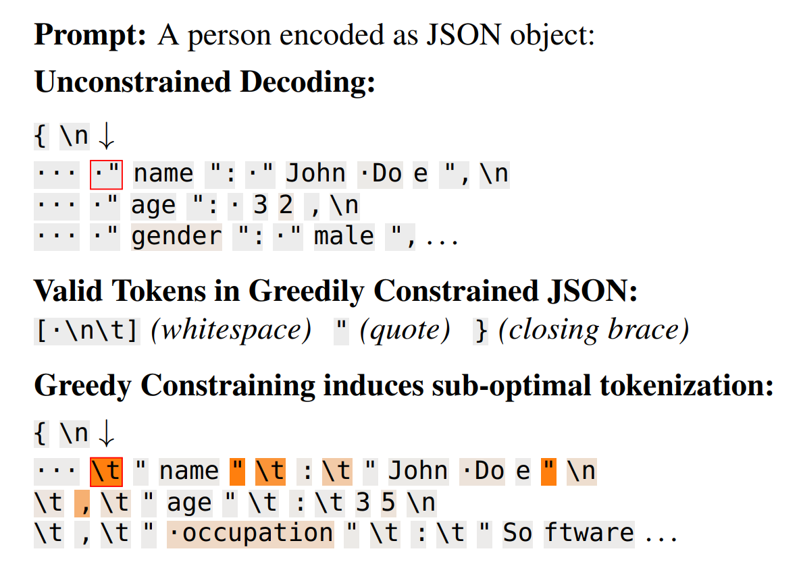

##### Cooperative decoding

#### Méthodes de `ConstrainedDecoding`

La `ConstrainedDecoding` est une technique qui permet de guider les modèles de génération de texte dans le respect de contraintes telles que le format, la validité d'une séquence (présence ou non de certains mots), etc.
Il faut distinguer plusieurs types de travaux sur la `ConstrainedDecoding`:
d'une part les travaux sur les méthodes de génération, leurs améliorations et leurs limites, d'autre part les travaux sur l'application de ces méthodes.

Dans un premier temps, nous nous concentrons sur les méthodes pour contraindre la génération puis nous nous intéresserons aux problèmes de `Tokenization` et aux performances induites par l'utilisation de grammaires pour contraindre la génération.
Enfin, nous décrirons les différentes tâches auxquelles ont été appliquées ces méthodes.

#### Contraintes Lexicales

[@scholak-etal-2021-picard]: Utilisation de parseurs pour générer des requêtes SQL valides.

#### Contraintes Grammaticales (Automates)

Le principe est de restreindre le support de mots/tokens/symboles pouvant être générés par le modèle.

[@sproat-normalization,zhang-normalization] construisent des `FST` (transducteurs à états finis) qui traduisent les formes écrites en formes verbales possibles, et utilisent ceux-ci pour guider/contraindre le modèle.

[@deutsch-etal-2019-general] utilisent des `FSA` et des `PDA` pour contraindre la sortie d'un modèle séquentiel à un certain langage formel.

Ces travaux ne traitent pas des problèmes entre la `Tokenization` du modèle de langue et le langage formel ciblé. Problème abordé en section~\ref{section:pb_constrain_gen}.

Les travaux de [@koo2024automatabased,guidance,Geng2023GrammarConstrainedDF] permettent une plus large gamme de contraintes, en prenant en charge n'importe quel langage régulier ou contextuel déterministe, et abordent également les problèmes inhérents aux tokenizers des modèles de langue actuels.

Parallèlement, les travaux de [@willard2023efficientguidedgenerationlarge] traitent du même sujet et abordent les problèmes avec la `Tokenization` par des moyens différents.

#### Problèmes de la génération contrainte{#paragraph:pb_constrain_gen}

#### Token Misalignment

La génération contrainte produit des tokens qui ne seraient pas produits "naturellement", ce qui induit des complétions avec une plus grande perplexité (indiquant que le modèle ne les aurait pas choisies sans contrainte).

\begin{figure}[H]
    \centering
    
    \caption{Illustration du problème de désalignement}
    {#fig:misalignement}
\end{figure}

Pour remédier à ce problème [@beurerkellner2024guidingllmsrightway] propose DOMINO (pas encore compris).

#### Comptation Overhead et Latence

La génération contrainte demande des calculs supplémentaires qui ajoute de la latence dans la génération.

#### Cas d'application du `ConstrainedDecoding`

Plusieurs travaux ont étudié l'utilisation du `ConstrainedDecoding`, avec ou sans LLMs.

#### Extraction d'information - Closed Information Extraction

La tâche consiste à extraire des triplets factuels à partir du texte.

[@josifoski-etal-2022-genie,Geng2023GrammarConstrainedDF]

`ConstituencyParsing` (CP): Analyse d'une phrase en un arbre syntaxique.

#### Désambiguïsation d'entités - `EntityDisambiguation`

Objectif: À partir d'une mention dans un texte, le modèle doit la désambiguïser en sélectionnant l'entité correcte dans une base de connaissances (par exemple, Wikipedia).

[@decao2021autoregressive,Geng2023GrammarConstrainedDF]

#### Liaison d'entités - `EntityLinking`

Objectif: Le modèle doit détecter les mentions dans un texte et les lier aux entités correspondantes de la base de connaissances. Cette tâche inclut à la fois la détection des mentions et leur désambiguïsation vers une entité de la base de connaissances.

[@decao2021autoregressive]

#### Recherche de documents au niveau des pages - Page-level Document Retrieval

Objectif: La tâche ici est de récupérer les pages Wikipedia pertinentes à partir d'une requête, où les titres des pages Wikipedia sont utilisés comme identifiants d'entités.

[@decao2021autoregressive]

#### Génération d'arbre syntaxique - `ConstituencyParsing`

Objectif: Générer des arbres d'analyse syntaxique valides à partir de séquences de tokens en utilisant une inférence contrainte. Cette tâche teste la capacité du modèle à produire des arbres syntaxiquement valides en fonction de diverses contraintes telles que des parenthèses équilibrées et des structures préterminales correctes.

[@deutsch-etal-2019-general]

#### `SRL`

Objectif: Identifier les rôles des constituants dans une phrase par rapport à un prédicat en utilisant des étiquettes d'arguments valides. Le modèle est contraint pour éviter les erreurs courantes telles que les arguments dupliqués ou les étiquettes d'argument invalides.

[@deutsch-etal-2019-general]

#### Normalisation de texte

[@sproat-normalization,zhang-normalization] utilisent les contraintes pour les applications de synthèse vocale (TTS).

#### `SemanticParsing`

`DSL` pour la `SemanticParsing`: sur les jeux de données \emph{SMCalFlow, Overnight, GeoQuery}.

[@bailin_wang2023grammar,shin-etal-2021-constrained]

#### Action `DSL`

[@bailin_wang2023grammar]: sur le jeu de données \emph{PDDL planning}

#### Génération de molécules `DSL`

[@bailin_wang2023grammar]: sur le jeu de données `SMILES`

#### Génération de code

[@scholak-etal-2021-picard]: Génération de SQL

[@fu2024constraineddecodingsecurecode]: Génération de C/C++/Python

#### Implémentations

Cette partie traite des implémentations de décodage contraint par grammaire/Automates.
- GUIDANCE: [@guidance]
    - llama.cpp:[@llamacpp]
    - Transformer-CFG: [@tcfg]
    - LMQL:[@BeurerKellner_LMQL]
    - OUTLINES:[@willard2023efficientguidedgenerationlarge]
